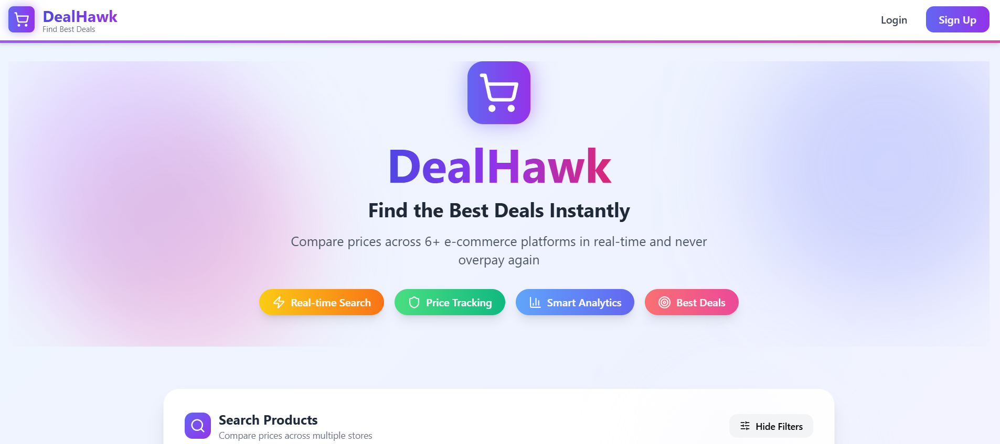
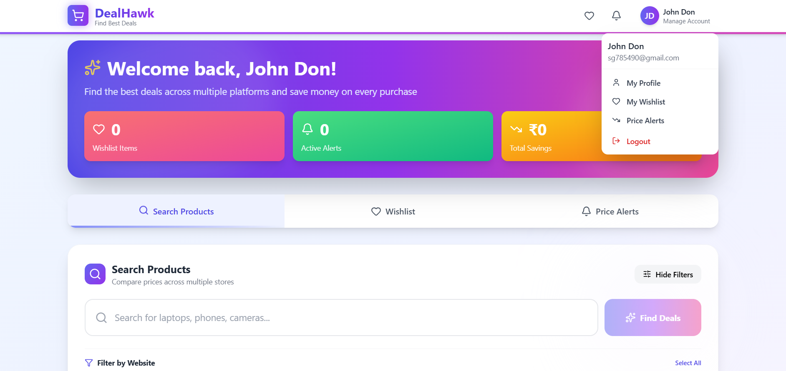
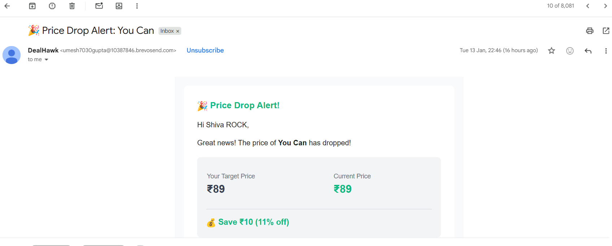
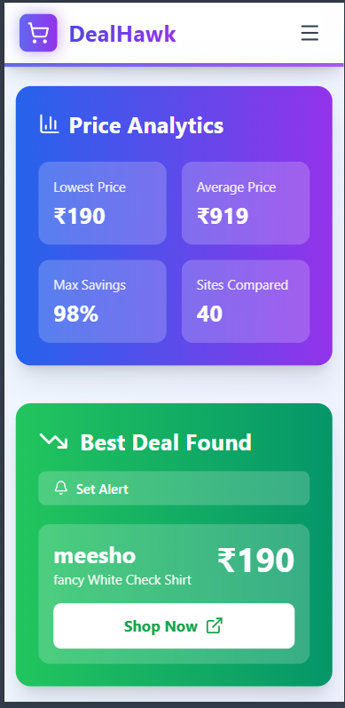

# 🦅 DealHawk - Smart Price Comparison Platform

<div align="center">


**Compare prices across 6+ e-commerce platforms instantly. Never overpay again.**

[](https://dealhawk.vercel.app)
[](https://dealhawk-api.railway.app/api-docs)
[](LICENSE)

[Features](#-features) • [Demo](#-demo) • [Tech Stack](#-tech-stack) • [Installation](#-installation) • [API](#-api-documentation) • [Contributing](#-contributing)

</div>

---

## 📋 Table of Contents

- [Overview](#-overview)
- [Features](#-features)
- [Demo](#-demo)
- [Tech Stack](#-tech-stack)
- [Architecture](#-architecture)
- [Installation](#-installation)
- [Environment Variables](#-environment-variables)
- [API Documentation](#-api-documentation)
- [Deployment](#-deployment)
- [Screenshots](#-screenshots)
- [Roadmap](#-roadmap)
- [Contributing](#-contributing)
- [License](#-license)
- [Contact](#-contact)

---

## 🎯 Overview

**DealHawk** is a full-stack web application that helps users find the best deals by comparing prices across multiple e-commerce platforms in real-time. Built with modern technologies and focused on user experience, DealHawk saves users time and money by aggregating product prices from Amazon, Flipkart, Snapdeal, Myntra, Shopsy, and Meesho.

### 🌟 Key Highlights

- 🔍 **Real-time Price Comparison** - Instant results across 6+ platforms
- 🔔 **Smart Price Alerts** - Get notified when prices drop
- 💝 **Wishlist Management** - Save and track your favorite products
- 📊 **Price History Analytics** - Make informed purchase decisions
- 🎨 **Modern UI/UX** - Beautiful, responsive design with smooth animations
- 🔐 **Secure Authentication** - JWT-based auth with OTP verification

---

## ✨ Features

### 🛍️ Core Features

| Feature | Description |
|---------|-------------|
| **Multi-Platform Search** | Search across Amazon, Flipkart, Snapdeal, Myntra, Shopsy, and Meesho simultaneously |
| **Price Comparison** | Side-by-side comparison with analytics (lowest, average, max savings) |
| **Price Alerts** | Set target prices and receive notifications when products reach your desired price |
| **Wishlist** | Save products and track price history over time |
| **Smart Filtering** | Filter by website, sort by price, rating, or availability |
| **Price History** | Visual charts showing price trends over time |

### 👤 User Features

- ✅ Email-based registration with OTP verification
- ✅ Secure JWT authentication
- ✅ Personal dashboard with statistics
- ✅ Profile management
- ✅ Search history

### 🎨 UI/UX Features

- ✅ Modern gradient designs with glassmorphism effects
- ✅ Smooth animations and micro-interactions
- ✅ Responsive design (mobile, tablet, desktop)
- ✅ Dark mode ready (coming soon)
- ✅ Accessibility compliant

---

## 🎥 Demo

### Live Application
🔗 **[https://dealhawk.vercel.app](https://dealhawk.vercel.app)**

### Demo Credentials
```
Email: demo@dealhawk.com
Password: demo123456
```

## 🛠️ Tech Stack

### Frontend


### Backend


### External APIs
- 🔍 **SerpAPI** - Web scraping and price data aggregation
- 📧 **BrevoAPI** - Email notifications

### DevOps & Deployment


---

## 🏗️ Architecture

```
┌─────────────────────────────────────────────────────────────┐
│                         Client Layer                         │
│                    (React + Tailwind CSS)                    │
│  ┌──────────┐  ┌──────────┐  ┌──────────┐  ┌──────────┐   │
│  │   Home   │  │Dashboard │  │ Wishlist │  │  Alerts  │   │
│  └──────────┘  └──────────┘  └──────────┘  └──────────┘   │
└─────────────────────────────────────────────────────────────┘
                            ↕ HTTPS
┌─────────────────────────────────────────────────────────────┐
│                      API Gateway Layer                       │
│                   (Express.js Middleware)                    │
│  ┌──────────┐  ┌──────────┐  ┌──────────┐  ┌──────────┐   │
│  │   Auth   │  │   CORS   │  │   Rate   │  │  Error   │   │
│  │          │  │          │  │  Limit   │  │ Handler  │   │
│  └──────────┘  └──────────┘  └──────────┘  └──────────┘   │
└─────────────────────────────────────────────────────────────┘
                            ↕
┌─────────────────────────────────────────────────────────────┐
│                      Business Logic Layer                    │
│  ┌──────────────┐  ┌──────────────┐  ┌──────────────┐     │
│  │   Product    │  │   Wishlist   │  │    Alert     │     │
│  │  Controller  │  │  Controller  │  │  Controller  │     │
│  └──────────────┘  └──────────────┘  └──────────────┘     │
└─────────────────────────────────────────────────────────────┘
                            ↕
┌─────────────────────────────────────────────────────────────┐
│                      Service Layer                           │
│  ┌──────────────┐  ┌──────────────┐  ┌──────────────┐     │
│  │   Scraping   │  │     Email    │  │     Auth     │     │
│  │   Service    │  │   Service    │  │   Service    │     │
│  └──────────────┘  └──────────────┘  └──────────────┘     │
└─────────────────────────────────────────────────────────────┘
                            ↕
┌─────────────────────────────────────────────────────────────┐
│                      Data Layer                              │
│  ┌──────────────┐  ┌──────────────┐  ┌──────────────┐     │
│  │    User      │  │   Product    │  │    Alert     │     │
│  │    Model     │  │    Model     │  │    Model     │     │
│  └──────────────┘  └──────────────┘  └──────────────┘     │
│                    MongoDB Atlas                             │
└─────────────────────────────────────────────────────────────┘
```

---

## 🚀 Installation

### Prerequisites

- Node.js (v18 or higher)
- MongoDB (v6 or higher)
- npm or yarn
- SerpAPI key ([Get one here](https://serpapi.com))
- Gmail account for Brevo API

### Clone Repository

```bash
git clone https://github.com/yourusername/dealhawk.git
cd dealhawk
```

### Backend Setup

```bash
# Navigate to backend directory
cd backend

# Install dependencies
npm install

# Create .env file
cp .env.example .env

# Edit .env with your credentials
nano .env

# Start development server
npm run dev
```

### Frontend Setup

```bash
# Navigate to frontend directory
cd frontend

# Install dependencies
npm install

# Create .env file
cp .env.example .env

# Edit .env with backend URL
nano .env

# Start development server
npm start
```

### Access Application

- **Frontend**: http://localhost:3000
- **Backend**: http://localhost:5000
- **API Docs**: http://localhost:5000/api-docs

---

## 🔐 Environment Variables

### Backend (.env)

```bash
# Server Configuration
NODE_ENV=development
PORT=5000

# Database
MONGODB_URI=mongodb://localhost:27017/dealhawk

# JWT Configuration
JWT_SECRET=your_super_secret_jwt_key_here_change_in_production
JWT_EXPIRE=7d

# Email Configuration (Gmail)
EMAIL_USER=your-email@gmail.com
EMAIL_PASSWORD=your-app-specific-password

# External APIs
SERPAPI_KEY=your_serpapi_key_here

# Frontend URL (for CORS)
FRONTEND_URL=http://localhost:3000

# Rate Limiting
RATE_LIMIT_WINDOW_MS=900000
RATE_LIMIT_MAX_REQUESTS=100
```

### Frontend (.env)

```bash
REACT_APP_API_URL=http://localhost:5000
REACT_APP_ENV=development
```

---

## 📚 API Documentation

### Authentication Endpoints

#### Register User
```http
POST /api/auth/register
Content-Type: application/json

{
  "name": "John Doe",
  "email": "john@example.com",
  "password": "password123",
  "phone": "+911234567890"
}
```

#### Verify OTP
```http
POST /api/auth/verify-otp
Content-Type: application/json

{
  "email": "john@example.com",
  "otp": "123456"
}
```

#### Login
```http
POST /api/auth/login
Content-Type: application/json

{
  "email": "john@example.com",
  "password": "password123"
}
```

### Product Endpoints

#### Search Products
```http
GET /api/products/search?q=laptop&websites=amazon,flipkart&sortBy=price
Authorization: Bearer {token}
```

#### Get Product Details
```http
GET /api/products/:productId
Authorization: Bearer {token}
```

### Wishlist Endpoints

#### Get Wishlist
```http
GET /api/wishlist
Authorization: Bearer {token}
```

#### Add to Wishlist
```http
POST /api/wishlist
Authorization: Bearer {token}
Content-Type: application/json

{
  "productName": "iPhone 15 Pro",
  "website": "amazon",
  "currentPrice": 129900,
  "url": "https://amazon.in/...",
  "imageUrl": "https://..."
}
```

### Alert Endpoints

#### Create Price Alert
```http
POST /api/alerts
Authorization: Bearer {token}
Content-Type: application/json

{
  "productName": "iPhone 15 Pro",
  "currentPrice": 129900,
  "targetPrice": 119900,
  "website": "amazon"
}
```

#### Get User Alerts
```http
GET /api/alerts
Authorization: Bearer {token}
```

**Full API Documentation**: [https://dealhawk-api.railway.app/api-docs](https://dealhawk-api.railway.app/api-docs)

---

## 🌐 Deployment

### Quick Deployment

#### Frontend (Vercel)
```bash
cd frontend
vercel --prod
```

#### Backend (Railway)
```bash
cd backend
railway up
```

### Detailed Deployment Guide

See [DEPLOYMENT.md](DEPLOYMENT.md) for comprehensive deployment instructions including:
- MongoDB Atlas setup
- Environment variable configuration
- Custom domain setup
- SSL certificate configuration
- CI/CD pipeline setup

---

## 📸 Screenshots

### Home Page


### Product Comparison


### Dashboard


### Price Alerts


### Mobile View


---

## 🗺️ Roadmap

### Phase 1 - MVP ✅ (Completed)
- [x] User authentication
- [x] Product search and comparison
- [x] Wishlist management
- [x] Price alerts
- [x] Responsive design

### Phase 2 - Enhancements 🚧 (In Progress)
- [ ] Dark mode
- [ ] Browser extension
- [ ] Advanced filtering
- [ ] Price history graphs
- [ ] Export data feature

### Phase 3 - Advanced Features 📋 (Planned)
- [ ] AI-powered price predictions
- [ ] Mobile app (React Native)
- [ ] Social sharing features
- [ ] Cashback integration
- [ ] Multi-language support

### Phase 4 - Enterprise 🎯 (Future)
- [ ] API for third-party developers
- [ ] White-label solution
- [ ] Advanced analytics dashboard
- [ ] Affiliate program

---

## 🤝 Contributing

Contributions are welcome! Please follow these steps:

1. **Fork the repository**
2. **Create your feature branch** (`git checkout -b feature/AmazingFeature`)
3. **Commit your changes** (`git commit -m 'Add some AmazingFeature'`)
4. **Push to the branch** (`git push origin feature/AmazingFeature`)
5. **Open a Pull Request**

### Contribution Guidelines

- Follow the existing code style
- Write meaningful commit messages
- Add tests for new features
- Update documentation as needed
- Ensure all tests pass before submitting PR

See [CONTRIBUTING.md](CONTRIBUTING.md) for detailed guidelines.

---

## 📝 License

This project is licensed under the MIT License - see the [LICENSE](LICENSE) file for details.

---

## 👨‍💻 Author

**Sivananda Gupta**

- Email: sg823607@gmail.com

---

## 🙏 Acknowledgments

- [SerpAPI](https://serpapi.com) - For web scraping capabilities
- [Vercel](https://vercel.com) - For frontend hosting
- [Railway](https://railway.app) - For backend deployment
- [MongoDB Atlas](https://www.mongodb.com/atlas) - For database hosting
- [Tailwind CSS](https://tailwindcss.com) - For styling
- [Lucide Icons](https://lucide.dev) - For beautiful icons

---

## 📊 Project Stats


---

<div align="center">

**⭐ Star this repo if you find it helpful!**

Made with ❤️ by [Sivananda Gupta](https://github.com/shivagupta999)

[⬆ Back to Top](#-dealhawk---smart-price-comparison-platform)

</div>
